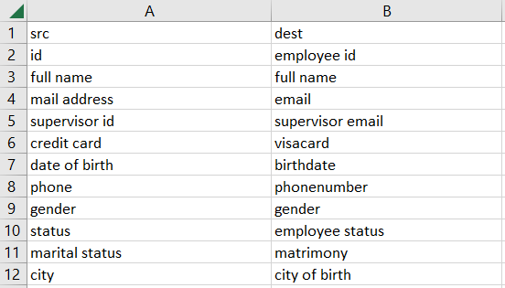

# DatAlign


## Table of Contents
- [DatAlign](#datalign)
  - [Table of Contents](#table-of-contents)
  - [Description](#description)
    - [Key Features](#key-features)
    - [Report Generation](#report-generation)
  - [Installation](#installation)
  - [Usage](#usage)
    - [Default view](#default-view)
    - [Simple Mode (Without Config File)](#simple-mode-without-config-file)
    - [Config File Mode (advanced)](#config-file-mode-advanced)
  - [Configuration Documentation](#configuration-documentation)
    - [Mapping Format](#mapping-format)
    - [Transformations](#transformations)
    - [config.yml file](#configyml-file)
      - [`id_mapping`](#id_mapping)
      - [`mappingfile`](#mappingfile)
      - [`options`](#options)
      - [`source1` \& `source2`](#source1--source2)

## Description
DatAlign is a powerful Python-based data alignment and quality assurance tool designed to merge and align two datasets based on a user-defined mapping file. This application streamlines the process of combining data from disparate sources while ensuring data quality and consistency.


### Key Features
- Merging Datasets: DatAlign takes three input files : two datasets (src and dest), and a mapping file created by the user. This mapping file establishes the relationship between fields in both datasets. Only the fields of interest can be put in the mapping file, the other are ignored during the process.

- Customizable Pivot Parameters: Users define the "pivot parameters" for each dataset, such as ID/Employee ID, Email/Mail address, or other relevant identifiers in src and dest. These parameters serve as the basis for data alignment.

- Main ID: Users define for each dataset a _main id_ which should be the most relevant identifier (such as ID/Employee ID). This allows the research for anomalies such as duplicates or multiple matches for a single _main id_.

- Data Quality Verification: DatAlign's primary objective is to validate data quality and consistency. It checks for duplicates, unmatched values, and other quality-related features.

### Report Generation
- Detailed Reports: The result of DatAlign's analysis is a comprehensive Excel (.xlsx) report. This report consists of multiple sheets, each offering valuable insights into the data alignment process.

- Match Highlighting: One of the report's sheets displays matched data based on pivot parameters. Columns are presented as pairs, e.g., "src_id, dest_employeeid", "src_email, dest_mailaddress." Matched values are highlighted in blue, while discrepancies are marked in red.

- Statistical Insights: The report includes statistics such as match ratio per field, the number of matched and unmatched records, and various warnings. These insights help users assess the alignment's accuracy and completeness.

- Data Consistency Analysis: DatAlign goes beyond alignment and evaluates data for consistency, flagging duplicates and identifying inconsistencies in the datasets.

DatAlign empowers users to efficiently align and validate datasets, making it an indispensable tool for data integration, quality assurance, and data-driven decision-making.

## Installation
To install DatAlign, follow these steps:

1. Clone the repository:
```bash
   git clone https://github.com/JeremyLezmy/datalign.git
```
2. Navigate to the project directory:
```bash
   cd datalign
```
3. Install the required dependencies (we strongly advise to use a venv):
```bash
   pip install -r requirements.txt
```


## Usage

You can ether:
- launch the app using:
```bash
   python main.py ## located in /src folder
```
- install the executable file using PyInstaller and the _main.spec_ file included in the repo.
```bash
   python -m PyInstaller main.spec ## located in /src folder
```
- directly download and use the `DatAlign.exe` file in the Release.

DatAlign provides two distinct modes of usage, allowing users to align and analyze their datasets in a way that best suits their needs:

### Default view

|  |
| :-------------------------------------------------------: |
|                  *DatAlign default view*                  |

### Simple Mode (Without Config File)

In the **Simple Mode**, users can align and analyze their datasets without the need for a configuration file. Follow these steps to use DatAlign in Simple Mode:

1. **Drag and Drop Files:** On the main page of the application, you can either drag and drop your three files (_src_ dataset, _dest_ dataset, and mapping file) or click the designated buttons to upload them.

2. **Parameter Inputs:** Fill in the required parameters on the main page. These parameters include pivot parameters, field identifiers, and other mandatory information needed for the analysis.

3. **Start Analysis:** After providing all the necessary information, click the "Process and Generate Report" button to initiate the analysis. DatAlign will use the input parameters to align and analyze the data, generating a detailed report in Excel format.

### Config File Mode (advanced)

In the **Config File Mode**, the entire analysis is driven by a configuration file (config.yml). This mode is ideal for users who prefer a more customizable and automated approach. Here's how to use DatAlign in Config File Mode:

1. **Generate Template Config File:** If you're new to the application, you can generate a template config file by clicking the dedicated button on the main page (located in the lower left corner).

2. **Configure the Config File:** Open the generated config file and provide all the necessary parameters, including pivot parameters, field identifiers, and any other customizations required for your analysis. The config file allows for extensive customization (see the Configuration section for details).

3. **Run Analysis:** Once the config file is complete, save it, and then run DatAlign using the following command.


## Configuration Documentation


### Mapping Format

The mapping file has to be a `.csv` format. As shown below, 3 columns are necessary:

- `src` for the first dataframe;
- `dest` for the second dataframe;
- `type` of the given field.

If the type of a given field is a date, the string "date" has to be written. Further types might be implemented in the future.

|  |
| :---------------------------------------------------: |
|                *Mapping file example*                 |


### Transformations

The application also allows the user to perform many-to-one transformations, based on the field name. We give here the steps to apply such a transformation on the `src` file, which can also be applied to the `dest` file.

1. The user must create a folder named `transformations` at the root of the `src` file.
2. One `.csv` file with a semicolon (`;`) separator must be created for **each** field to transform. The file name has to be the same as the field to transform (e.g., `gender.csv`, `country.csv`, etc).
3. Each CSV file must contain 2 columns: `src` (value to transform) and `dist` (transformed value).
4. During the process, the application will automatically detect the presence of the `transformations` folder and iterate over the `.csv` files inside it.

If there isn't any `transformations` folder, the code will ignore this step. If a file inside the `transformations` folder has a name that doesn't correspond with any field in the `src` file, the transformation will be ignored. This feature is applied before the `lambda` transformations (see [fields_lbda_trans](#source1--source2)).
We show below an example of transformation file labeled _marital_status.csv_, "_marital_status_" being the field name in _src_ dataframe:

|  |
| :------------------------------------------------------------------: |
|      *Transformation file example for **marital_status** field*      |

### config.yml file

The configuration file (config.yml) allows you to customize DatAlign's behavior to align and analyze your datasets precisely. Since this is a _.yml_ file, **beware** to the indent for parameters with **list** or **list of list** values. Below, you'll find details about various configuration sections and their parameters.

#### `id_mapping`

Specifies general details about the mapping.

- `case_sensitive`: Boolean, tell if the alignment should be case sensitive. If _false_ (default) all the values/columns will be lowered during the analysis for more robust alignment.
- `filename`: (Dynamic parameter, do not change)
- `method`: The method used for Data Alignment. Currently, only "Basic" (default) is implemented.
- `pivot_alias`: List of pivot aliases for sheet names in the final report. Aliases should be short. If not provided, only the first 15 characters from the pivot fields will be kept (due to Excel limitation).
- `sep`: (Deprecated parameter, will be removed soon)
- `source1_id`: (Deprecated parameter, will be removed soon)
- `source2_id`: (Deprecated parameter, will be removed soon)

#### `mappingfile`

Specifies details about the mapping file.

- `filename`: (Dynamic parameter, do not change)
- `init_path`: Absolute path of the mapping file. It must be in CSV format.
- `separator`: Separator used for the mapping file.

#### `options`

Deprecated section, will be removed soon.

#### `source1` & `source2`

Specifies details about the configuration for source 1 (_src_) and source 2 (_dest_).

- `aggregation_field`: (Not implemented yet, ignore)

- `all_pivots`: List of all pivot fields for source 1 (and source 2). Should be parsed as a **list**.
  - Field 1
  - Field 2
  - Field 3

- `date_format`: Date format string, e.g., "%Y/%m/%d" for YYYY/MM/DD format. This allows modification of date-type fields between both sources.

- `fields_lbda_trans`: List of fields for lambda transformations. Should be parsed as a **list**.
  - Field 1
  - Field 2
  - Field 3

- `lbda_trans`: List of lambda transformations for fields given in `fields_lbda_trans`. Each lambda transformation should be written in Python format. Should be parsed as a **list**.
  - Field 1
  - Field 2
  - Field 3

- `fields_to_filter`: List of fields to filter. Should be parsed as a **list**.
  - Field 1
  - Field 2
  - Field 3

- `values_to_filter`: Nested list of values to filter for fields given in `fields_to_filter`. Should be parsed as a **list of lists**.
  - - Value 1 (field 1)
    - Value 2 (field 1)
  - - Value 1 (field 2)
  - - Value 1 (field 3)

- `fields_to_merge`: Fields to merge together. The separator will be a sapce. Should be parsed as a **list of list**.
  - - Field 1 to merge with
    - Field 2 and
    - Field 3
  - - Field 4 to merge with
    - Field 5

- `fields_to_merge_name`: Fields name as to give as result to the merged fields in `fields_to_merge`. Should be parsed as a **list**.
  - Field 1
  - Field 2

- `dupl_priority_field`: Field used to apply a filter on the entries with duplicate _main_id_ to keep some of them depending of this field value (see `dupl_priority_value`). Should be part of the mapping, otherwise ignored.

- `dupl_priority_value`: Value used as top priority in the field `dupl_priority_field`. Before isolating values with duplicate _main_id_, the code will grouped them by _main_id_ and check the `dupl_priority_field`. If there is a unique entry with the  `dupl_priority_value`, then this entry will be used in the main analysis. Otherwise they will remain in the isolated duplicate _main_id_ entries.

- `automerge_field`: Field to automerge with the destination field and the pivot field. Should be parsed as a **list of lists**.
  - - Field to auto-merge (e.g., Manager ID)
    - Destination field (e.g., Email)
    - Pivot field (e.g., ID)
    - New field name (e.g., Manager Email) (optional, if not provided, the new values will replace the Field to merge)
  - - Field to auto-merge 2
    - Destination field 2
    - Pivot field 2
    - New field name 2 (optional)

- `filename`: (Dynamic parameter, do not change)

- `get_country_from_le`: (Deprecated parameter, will be removed soon)

- `id_field`: (Dynamic parameter, do not change)

- `init_path`: Absolute path of the file. It must be in CSV or XLSX format.

- `main_id`: Main ID field for source 1.
- `mapping_col_name`: Name of the column in the mapping file corresponding to source 1. Should be "src."

- `name`: Alias name (e.g., src / dest, df1 / df2 ... ). It will be used for the generated filename (soon fused with the `prefix` parameter).

- `pivot_field`: (Dynamic parameter, do not change)

- `prefix`: Prefix (e.g., src_ / dest_ ...). Used as a signature for field and sheet names in the final report.

- `separator`: Separator used (matters if file in _.csv_ format).

- `skiprows`: Number of rows to skip in the data (header or blank rows).


This documentation is also present in the App's Wiki page :smile: .